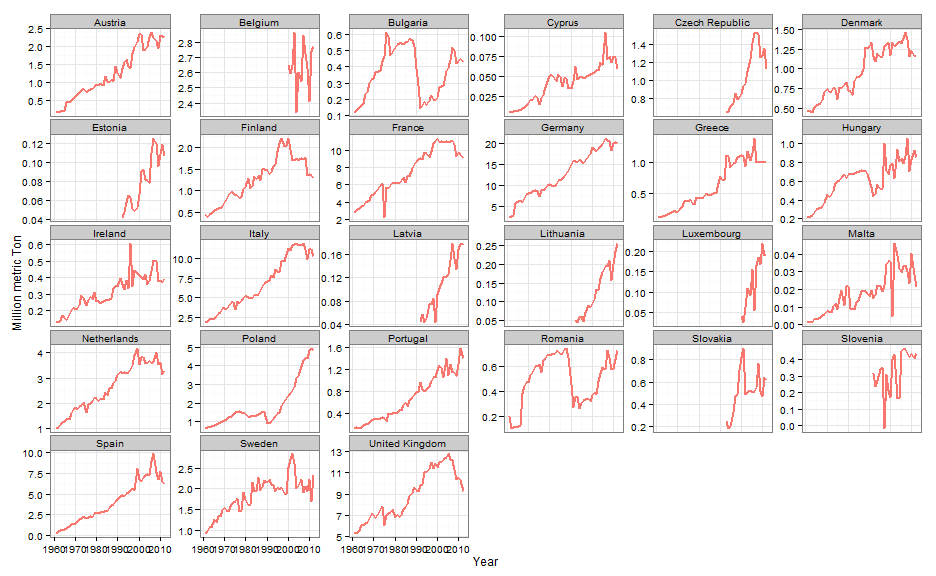
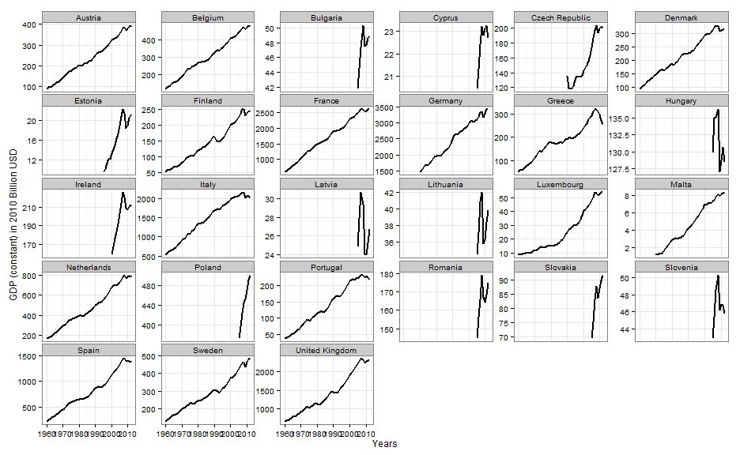
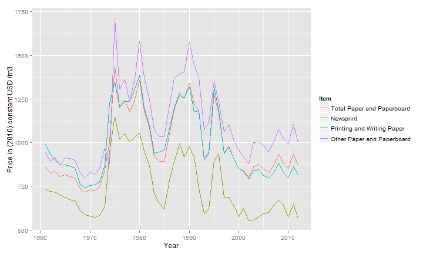
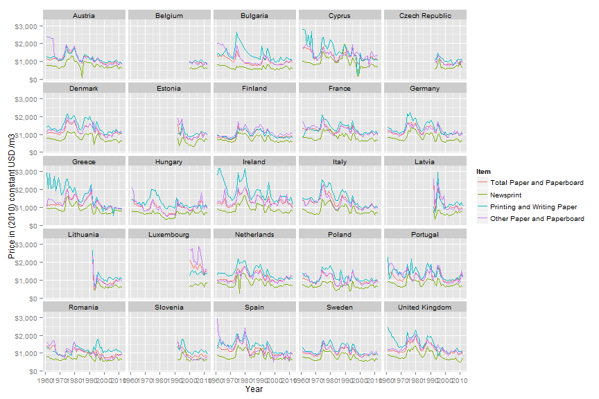
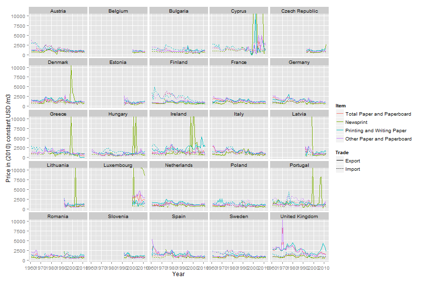
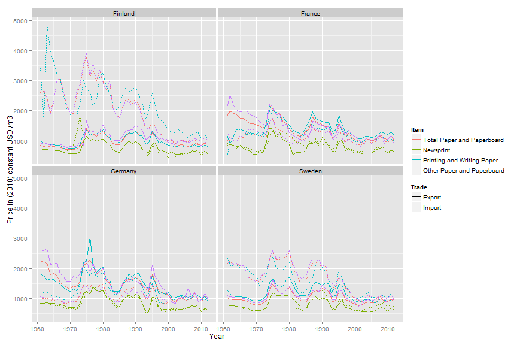

Explore demand for forest products
========================================================

Load data
--------------------------


```r
load("Y:/Macro/Demand Econometric Models/enddata/EU27 paper products demand.rdata")
pp = paperProducts
pp$Consumption = pp$Consumption/1e+06  # Change Tons to Million Tons
wb$GDPconstantUSD = wb$GDPconstantUSD/1e+09  # Change dollars to Billion dollars
```


The paper and paperboard table contains consumption data for **27** countries from 1961 to 2012.  
In 2012, the overall EU consumption in million m3 per item was:

```
## Error: could not find function "ddply"
```


Consumption of paper and paperboard products in EU-27
-----------------

```r
# Select Consumption data from 1969 to the most recent
ppc = subset(pp, Year >= 1969, select = c(Item, Country, Year, Consumption))
ppc = aggregate(ppc["Consumption"], ppc[c("Item", "Year")], sum)

# Plot total consumption at the european level
ggplot(data = ppc, aes(x = Year, y = Consumption, colour = Item)) + geom_line(size = 1) + 
    ylab("Million metric Ton") + theme_bw()
```

 


### Total consumption of paper and paperboard by country 

```r
ggplot(data = subset(pp, Item == "Total Paper and Paperboard")) + geom_line(aes(x = Year, 
    y = Consumption, colour = Item), size = 1) + xlab("Year") + ylab("Million metric Ton") + 
    theme_bw() + theme(legend.position = "none") + facet_wrap(~Country, scales = "free_y")
```

 


Note to Paul: try an interactive map with [GoogleVis](http://rpubs.com/gallery/googleVis).

### GDP by country

```r
# 1 plot per country
ggplot(data = wb, aes(x = Year, y = GDPconstantUSD)) + geom_line(size = 1) + xlab("Years") + 
    ylab("GDP (constant) in 2010 Billion USD ") + theme_bw() + theme(legend.position = "none") + 
    facet_wrap(~Country, scales = "free_y")
```

 


Prices of paper and paperboard products
----------------
### Price for Finland

```r
ggplot(data = subset(pp, Country == "Finland")) + geom_line(aes(x = Year, y = Price, 
    color = Item)) + ylab("Price in (2010) constant USD /m3")
```

 


### Prices per country - remove countries with a particularly high price
Prices are a ponderation of import and export prices as used in Chas-Amil and Buongiorno 2000. Prices are expressed in constant US dollard of 2010.
```
Price = (Import_Value + Export_Value)/
            (Import_Quantity + Export_Quantity) / DeflUS *1000)
```


```r
library(scales)
ggplot(data = subset(pp, !Country %in% c("Slovakia", "Malta"))) + geom_line(aes(x = Year, 
    y = Price, color = Item)) + facet_wrap(~Country) + ylab("Price in (2010) constant USD /m3") + 
    scale_y_continuous(labels = dollar)
```

 


### Trade prices by Country

```r
ggplot(data = subset(pptrade, !Country %in% c("Slovakia", "Malta"))) + geom_line(aes(x = Year, 
    y = Price_Trade, color = Item, linetype = Trade)) + facet_wrap(~Country) + ylab("Price in (2010) constant USD /m3")
```

 

```r

# Sweden Germany France Finland UK
ggplot(data = subset(pptrade, Country %in% c("Sweden", "Germany", "France", "Finland"))) + 
    geom_line(aes(x = Year, y = Price_Trade, color = Item, linetype = Trade)) + facet_wrap(~Country) + 
    ylab("Price in (2010) constant USD /m3")
```

 


