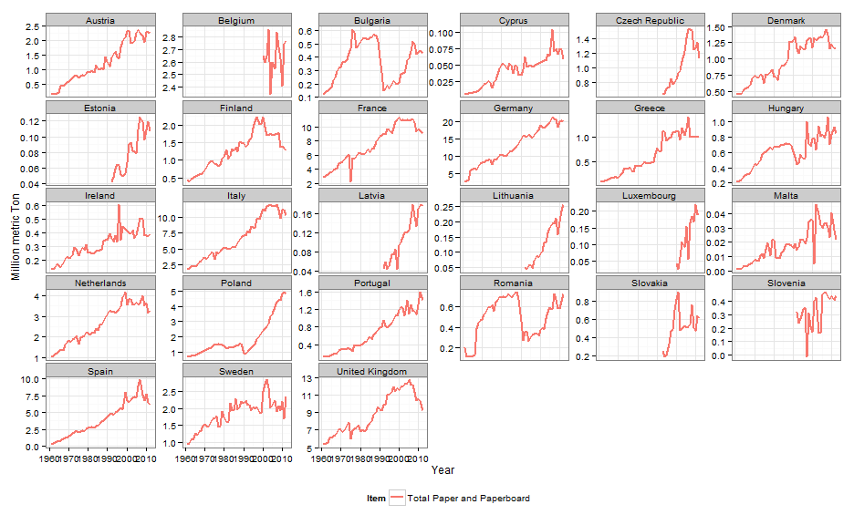
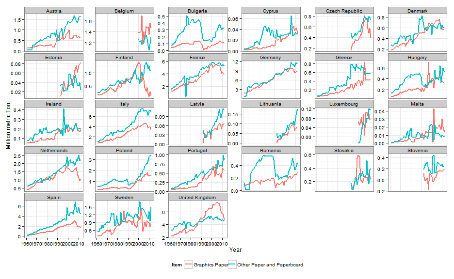
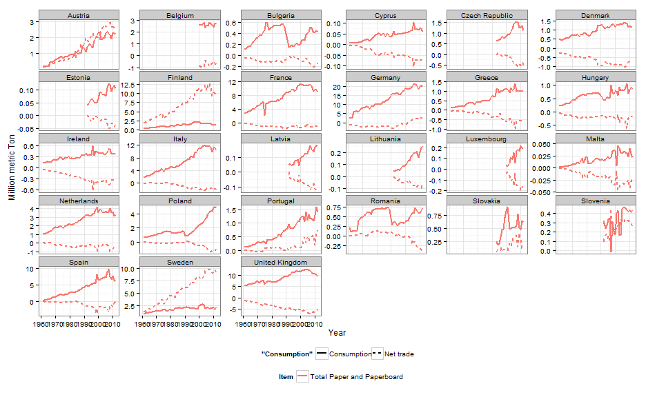
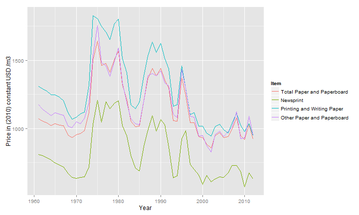
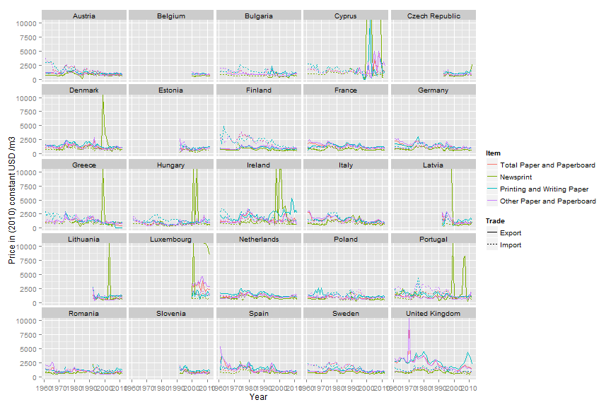
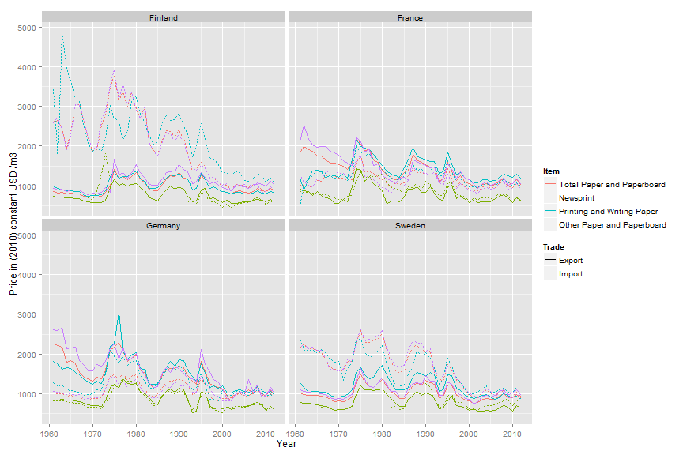

Demand for paper and paperboard products in the European Union
========================================================


FAOSTAT is the source of forest products data and
World Bank is the source of GDP, deflator and exchange rate data.  
This code chunk loads data frames:

```r
print(load("Y:/Macro/forestproductsdemand/enddata/EU27 paper products demand.rdata"))
```

```
## [1] "paperProducts" "ppagg"         "pptrade"       "wb"
```

```r
pp = paperProducts  # Give a shorter name to the data frame
```


Consumption, Production and Trade Volumes
-----------------
In the following file, we explore a data table containing paper and paperboard consumption data for **27** countries from 1961 to 2012.  
**In 2012, the overall EU consumption, production and trade in million Tons per item was:**

```
##                           Item Consumption Production Net_Trade Import Export
## 205 Total Paper and Paperboard          80         92        12     49     61
## 206                  Newsprint           7          8         0      5      5
## 207 Printing and Writing Paper          24         32         8     20     27
## 208 Other Paper and Paperboard          49         53         4     24     28
```


```r
# Consumption, production, trade and net trade at the European Level
ggplot(data = subset(ppagg, !Element %in% c("Import_Value", "Export_Value", "Price"))) + 
    geom_line(aes(x = Year, y = Value/1e+06, colour = Item), size = 1) + facet_wrap(~Element) + 
    ylab("Million metric Ton") + theme_bw()
```

 

Net trade is slightly in favor of exports for most products except for newsprint. From bilateral trade statistics (not shown here), we know that most of the trade is happening inside the European Union.

### Consumption by country 
Apparent consumption of Total paper and paperboard by country 

```r
ggplot(data = subset(pp, Item == "Total Paper and Paperboard")) + geom_line(aes(x = Year, 
    y = Consumption/1e+06, colour = Item), size = 1) + facet_wrap(~Country, scales = "free_y") + 
    xlab("Year") + ylab("Million metric Ton") + theme_bw() + theme(legend.position = "bottom")
```

 

The largest consumers of paper and paperboard products are France, Germany, Italy, Spain, United Kingdom.


### Apparent consumption of graphics paper and other paper and paperboard by country 


```r
# Create a new table with graphics papers following Lauri's comments
ppgraph = subset(pp, Item %in% c("Newsprint", "Printing and Writing Paper"))
nrow(ppgraph)
```

```
## [1] 2275
```

```r
ppgraph = aggregate(ppgraph[c("Consumption", "Net_Trade")], ppgraph[c("Year", "Country")], 
    sum)
nrow(ppgraph)
```

```
## [1] 1138
```

```r
ppgraph$Item = "Graphics Paper"
ppgraph = rbind(ppgraph, subset(pp, Item == "Other Paper and Paperboard", c(Year, 
    Country, Item, Consumption, Net_Trade)))

ggplot(data = ppgraph) + geom_line(aes(x = Year, y = Consumption/1e+06, colour = Item), 
    size = 1) + facet_wrap(~Country, scales = "free_y") + xlab("Year") + ylab("Million metric Ton") + 
    theme_bw() + theme(legend.position = "bottom")
```

 


### Consumption and Net Trade by Country
Apparent consumption and Net Trade of Total paper and paperboard by country 

```r
ggplot(data = subset(pp, Item == "Total Paper and Paperboard")) + geom_line(aes(x = Year, 
    y = Consumption/1e+06, colour = Item, linetype = "Consumption"), size = 1) + 
    geom_line(aes(x = Year, y = Net_Trade/1e+06, colour = Item, linetype = "Net trade"), 
        size = 1) + facet_wrap(~Country, scales = "free_y") + xlab("Year") + ylab("Million metric Ton") + 
    theme_bw() + theme(legend.position = "bottom")
```

 

Large producing countries such as Finland and Sweden produce over 10 million tons of paper products per year and export most of their production. Germany is the largest consumer with over 20 million tons of paper products consumed annually, Germany's net trade is slightly positive. France is the second largest consumer and is slightly importing. The United Kingdom also consumes around 10 million tons annually and is importing more than half of its production.


### GDP by country

```r
# 1 plot per country
ggplot(data = wb, aes(x = Year, y = GDPconstantUSD/1e+09)) + geom_line(size = 1) + 
    xlab("Years") + ylab("GDP (constant) in 2010 Billion USD ") + theme_bw() + theme(legend.position = "none") + 
    facet_wrap(~Country, scales = "free_y")
```

 


Prices of paper and paperboard
----------------
### EU prices
Average trade price of paper products in the European Union

```r
ggplot(data = subset(ppagg, Element == "Price")) + geom_line(aes(x = Year, y = Value, 
    color = Item)) + ylab("Price in (2010) constant USD /m3")
```

 

Price has lowered since 2010, probably due to overcapacity in the market.

### Prices per country
Prices are a ponderation of import and export prices as used in Chas-Amil and Buongiorno 2000. Prices are expressed in constant US dollars of 2010.
```
Price = (Import_Value + Export_Value)/
            (Import_Quantity + Export_Quantity) / DeflUS *1000)
```
Countries with a particularly high price were removed from the set. 

```r
library(scales)
ggplot(data = subset(pp, !Country %in% c("Slovakia", "Malta"))) + geom_line(aes(x = Year, 
    y = Price, color = Item)) + facet_wrap(~Country) + ylab("Price in (2010) constant USD /m3") + 
    scale_y_continuous(labels = dollar)
```

 


### Trade prices by Country

```r
ggplot(data = subset(pptrade, !Country %in% c("Slovakia", "Malta"))) + geom_line(aes(x = Year, 
    y = Price_Trade, color = Item, linetype = Trade)) + facet_wrap(~Country) + ylab("Price in (2010) constant USD /m3")
```

 


### Trade prices for Sweden, Germany, France and Finland

```r
# Sweden Germany France Finland
ggplot(data = subset(pptrade, Country %in% c("Sweden", "Germany", "France", "Finland"))) + 
    geom_line(aes(x = Year, y = Price_Trade, color = Item, linetype = Trade)) + facet_wrap(~Country) + 
    ylab("Price in (2010) constant USD /m3")
```

 


